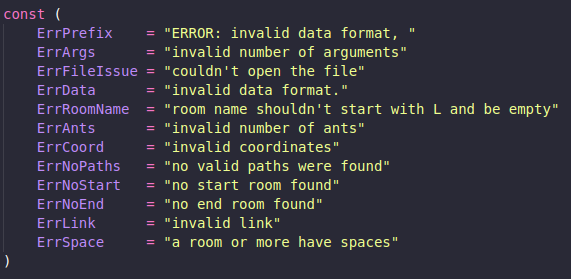

# 🐜 Lem-in

## 🎯 Objectives

This project is meant to code a digital version of an ant farm simulation in Go.

Your mission is to create a program called `lem-in` that:

- ✅ Reads a map (ants, rooms, and tunnels) from a file.
- ✅ Builds a representation of the colony (graph).
- ✅ Calculates the **quickest way** to move all ants from `##start` to `##end`.
- ✅ Displays **ant movements** turn by turn.
- ✅ Optimizes the moves, avoiding traffic jams and unnecessary steps.

The goal is to **bring all ants to the end room with as few moves as possible**, handling all input edge cases and errors gracefully.

---

## ⚙️ Project Overview

Your program simulates the behavior of ants crossing a colony. Here's how it works:

- You define an ant farm with rooms and tunnels.
- Ants start in a room marked `##start`.
- The target is to move all ants to a room marked `##end` in the least number of turns.
- Every room can only contain one ant at a time (except start/end).
- Each tunnel can only be used **once per turn**.

Your program must:

1. Parse the input correctly (rooms, tunnels, ants).
2. Build a graph-based representation of the colony.
3. Detect a combination of valid paths.
4. Pick the **best group** of paths to optimize ant movement.
5. Simulate the ant movements while avoiding invalid situations.
6. Display the movements in the correct format.

---

## 🔍 Algorithm Strategy

* I implemented a customized BFS algorithm (Editable BFS) to find all viable paths from `##start` to `##end`.


## Ant Distribution (Simulation)

### Path Assignment Phase
Before starting the simulation, each ant is assigned to one of the available disjoint paths.  
We use a **balanced load distribution** approach rather than a greedy one

* Each ant is assigned a path from the list of viable paths.
* I prioritize shorter paths but balance the load by assigning ants smartly to avoid collisions.
* Each turn, ants move forward one step, if the room ahead is free.
* I display only the ants that move per turn.

## 🧪 Example Output

```
go run . test0.txt
3
##start
start 2 2
r1 3 1
r2 3 3
r3 4 1
##end
end 5 2

start-r1
start-r2
r1-r3
r2-end
r3-end
```

## 🚫 Error Handling



## ✅ Rules

* Each ant must move only once per turn
* One ant per room at a time (except start/end)
* Tunnels used once per turn
* Rooms' names can’t contain spaces, or start with L/#
* Duplicate rooms or invalid coordinates are not allowed
* etc...
## 🧰 Tech Stack

* Go (no external packages)
* Standard libraries only (fmt, os, bufio, etc.)

## 🗂️ Project Structure

```text
├── README.md
├── cmd
│   └── main.go
├── compute
│   └── solver.go
├── const
│   └── const.go
├── go.mod
├── image.png
├── input.txt
├── maps
│   ├── README.md
│   ├── audit
│   │   ├── badexample00.txt
│   │   ├── badexample01.txt
│   │   ├── example00.txt
│   │   ├── example01.txt
│   │   ├── example02.txt
│   │   ├── example03.txt
│   │   ├── example04.txt
│   │   ├── example05.txt
│   │   ├── example06.txt
│   │   └── example07.txt
│   ├── bhandari
│   │   ├── bow.txt
│   │   ├── square-despair.txt
│   │   └── zhangir.txt
│   ├── custom
│   │   ├── extra-tails.txt
│   │   └── nrblzn.txt
│   └── default
│       ├── big_1.txt
│       ├── big_2.txt
│       ├── big_5.txt
│       ├── big_6.txt
│       ├── big_7.txt
│       ├── line-endurance.txt
│       └── loop.txt
├── parse
│   ├── checkers.go
│   └── parser.go
├── project_test.go
└── utils
    ├── bfs.go
    ├── dsa.go
    ├── filter.go
    ├── helpers.go
    ├── methods.go
    └── simulation.go


## 📁 Usage

```bash
go run ./cmd/ maps/directory_name/file.txt
```


## 🔚 Conclusion

This project simulates an optimized ant traversal using editable BFS and a non-greedy simulation engine for realistic and efficient movement control.